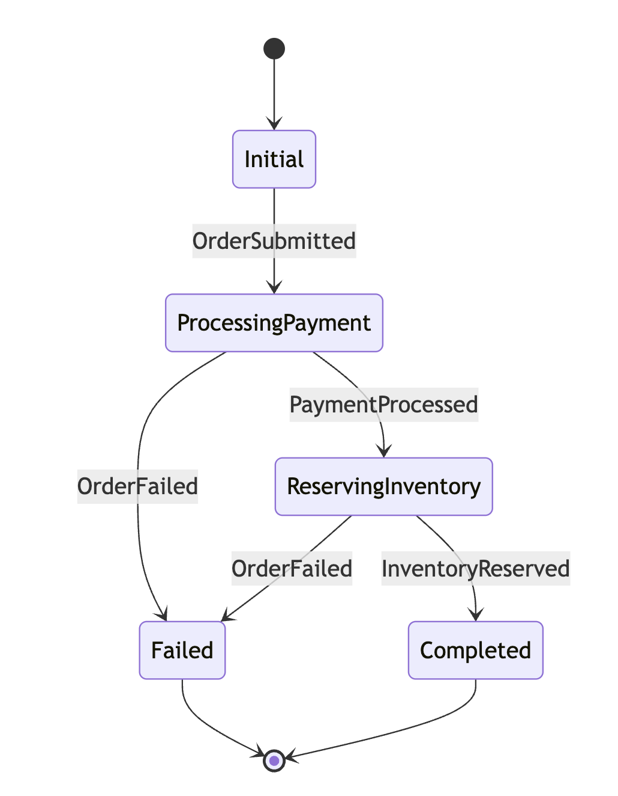

# NestJs Service Bus

This is a powerful NestJS library designed to simplify the integration and management of a **Service Bus** in your applications, utilizing **RabbitMQ** as the message broker. This library particularly stands out for its implementation of the **Saga Pattern**, helping you reliably and consistently manage distributed transactions.

## Why Use This Library?

In a microservices architecture, handling transactions that span across multiple services (distributed transactions) is a significant challenge. The Saga Pattern provides an effective solution for maintaining data consistency by orchestrating a sequence of local transactions, with the ability to roll back if any step fails.

This library offers:

* **Easy NestJS Integration:** Leveraging NestJS features like dependency injection, decorators, and modules for seamless Service Bus configuration and usage.
* **Saga Pattern Implementation:** Provides tools and structures to define, execute, and monitor Sagas, ensuring data consistency even when failures occur.
* **RabbitMQ Powered:** Utilizes RabbitMQ's performance and reliability as the message transport layer, supporting queuing, routing, and publish/subscribe.
* **Scalability:** Designed to be easily extensible and customizable to meet specific project needs.
* **Robust Error Handling:** Built-in error handling mechanisms help manage failure scenarios and trigger compensation steps within a Saga.

## Getting Started

### Installation
```bash
npm install nestjs-bustransit
# or
yarn add nestjs-bustransit
```

# Roadmap
- [x] RabbitMq Broker
- [x] Retry Level 1
- [x] Retry Level 2
- [x] Saga pattern
- [ ] Saga compensation
- [ ] Kafka broker

# Consumer configure
```javascript
@Global()
@Module({
    imports: [
        BusTransit.AddBusTransit.Setup((x) => {

            x.AddConsumer(SubmitOrderConsumer,);

            x.UsingRabbitMq(configService.get('APP_NAME'), (context, cfg) =>
            {
                cfg.Host(configService.get('RMQ_HOST'), configService.get('RMQ_VHOST'), (h) =>
                {
                    h.Username(configService.get('RMQ_USERNAME'));
                    h.Password(configService.get('RMQ_PASSWORD'));
                });

                cfg.ReceiveEndpoint("regular-orders-1", e => {
                    e.PrefetchCount = 30;
                    e.ConfigureConsumer(SubmitOrderConsumer, context, c => {
                        c.UseMessageRetry(r => r.Immediate(5)); // Retry 5 times
                    });
                });

            })
        }),
    ],
    controllers: [],
    providers: [],
})
export class MessagingInfrastructureModule {}
```

To use a Producer instance, inject it into the Consumer constructor with the IPublishEndpoint interface.
```javascript
export class OrderMessage {
    @IsNotEmpty()
    Text: string;
}

@Injectable()
export class SubmitOrderConsumer extends BusTransitConsumer<OrderMessage> {

    constructor(
        @Inject(IPublishEndpoint)
        private readonly publishEndpoint: IPublishEndpoint,
    ) {
        super(OrderMessage);
    }

    async Consume(ctx, context) {
        await super.Consume(ctx, context)
        Logger.debug('SubmitOrderConsumer receive')

        // Active a Saga flow
        const rs = await this.publishEndpoint.Send<OrderSubmitted>(new OrderSubmitted(
            {
                OrderId: uuidv7(),
                Total: 10000,
                Email: 'test@gmail.com'
            }
        ), null);

        console.log(context.Message);
        console.log(rs);
    }
}
```

# Saga Configure
See details <a href="https://github.com/diepnghitinh/nestjs-bustransit/tree/main/example/src/infrastructure/messaging/sagas" target="_blank">saga consumer</a> & Workflow



Code configure
```javascript
@Global()
@Module({
    imports: [
        BusTransit.AddBusTransit.setUp((x) => {

            x.AddConsumer(ProcessPaymentConsumer,).Endpoint(e => {
                e.Name = "saga-process-payment"
            });
            x.AddConsumer(ReserveInventoryConsumer,).Endpoint(e => {
                e.Name = "saga-reserve-inventory"
            });
            x.AddConsumer(OrderConfirmedConsumer,).Endpoint(e => {
                e.Name = "saga-order-confirmed"
            });
            x.AddConsumer(OrderRefundConsumer,).Endpoint(e => {
                e.Name = "saga-order-refund"
            });

            x.AddSagaStateMachine(OrderStateMachine, OrderState);

            x.UsingRabbitMq(configService.get('APP_NAME'), (context, cfg) =>
            {
                cfg.PrefetchCount = 50;

                cfg.Host(configService.get('RMQ_HOST'), configService.get('RMQ_VHOST'), (h) =>
                {
                    h.Username(configService.get('RMQ_USERNAME'));
                    h.Password(configService.get('RMQ_PASSWORD'));
                });

                // Others services saga
                cfg.ReceiveEndpoint("saga-process-payment", e => {
                    e.ConfigureConsumer(ProcessPaymentConsumer, context, c => {
                    });
                });

                cfg.ReceiveEndpoint("saga-reserve-inventory", e => {
                    e.ConfigureConsumer(ReserveInventoryConsumer, context, c => {
                    });
                });

                cfg.ReceiveEndpoint("saga-order-confirmed", e => {
                    e.ConfigureConsumer(OrderConfirmedConsumer, context, c => {
                    });
                });

                cfg.ReceiveEndpoint("saga-order-refund", e => {
                    e.ConfigureConsumer(OrderRefundConsumer, context, c => {
                    });
                });
            })
        })
    ],
    controllers: [
    ],
    providers: [
    ],
})
export class MessagingInfrastructureModule {}
```